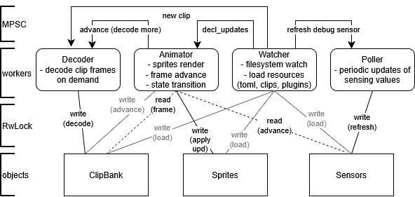

- Animator is responsible for managing Sprites.
- Decoder is responsible for managing ClipBank.
- Poller is responsible for managing Sensors.

## Resource reuse / deuse
- decl reuse: leaves sprites of intact decl definition untouched
- controller reuse: sprites state, clip_idx, frame_idx are kept untouched if only the position was changed
- clip data reuse: clips uses RefCell to actual data, only keeping decoded frame buffer
- sensing: sensing values are only refreshed if there are sprites actually read them